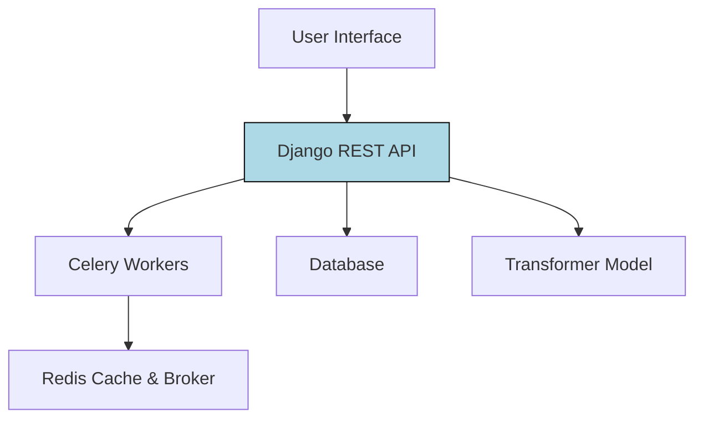

# PDF Summarizer Architecture

## 1) Hybrid Summarization Pipeline (left-to-right)

```mermaid
flowchart LR
    A[PDF Input] --> B[Text Extraction<br>(PyPDF2)]
    B --> C[Preprocessing<br>(Cleaning)]
    C --> D[Extractive Filtering<br>(TF-IDF + Position)]
    D --> E[Abstractive Model<br>(BART / T5)]
    E --> F[Final Summary]

    style D fill:#FFD700,stroke:#000,stroke-width:2px
```

- PDF Input
- PyPDF2 Text Extraction
- Text normalization + cleanup
- Extractive Filter (TF-IDF + position) highlighted in yellow
- Abstractive model generation (BART/T5)
- Final output summary

## 2) Django Deployment Architecture



- UI client calls Django REST API
- API stores job state in DB and dispatches Celery tasks
- Celery workers run PDF extraction, filtering, generation
- Redis handles queuing and caching
- Transformer model is called for abstractive summary
